# QuickHire

**AI-assisted hiring demo:** company job setup, CV ingestion with semantic search, Groq-powered screening and question generation, and a candidate interview experience with a **hint-only** in-editor assistant, telemetry, and scored reports.

This README is **orchestration- and LLM-focused**: how requests flow, where each model call happens, which prompts apply, and how LangChain / LangGraph / Chroma fit together. For a broader file-by-file tour, see [`docs/CODEBASE_GUIDE.md`](docs/CODEBASE_GUIDE.md).

---

## Table of contents

1. [Visual system map](#1-visual-system-map)
2. [Orchestration layers](#2-orchestration-layers)
3. [LLM call inventory](#3-llm-call-inventory)
4. [RAG and embeddings pipeline](#4-rag-and-embeddings-pipeline)
5. [REST-driven LLM flows](#5-rest-driven-llm-flows)
6. [WebSocket interview orchestration](#6-websocket-interview-orchestration)
7. [LangGraph agent (Socratic graph)](#7-langgraph-agent-socratic-graph)
8. [Prompt and message construction](#8-prompt-and-message-construction)
9. [Reliability: retries and fallbacks](#9-reliability-retries-and-fallbacks)
10. [Configuration and secrets](#10-configuration-and-secrets)
11. [Running locally](#11-running-locally)
12. [Known gaps and documentation debt](#12-known-gaps-and-documentation-debt)

---

## 1. Visual system map

High-level placement of **human actors**, **apps**, **API**, **data stores**, and **external LLM**.

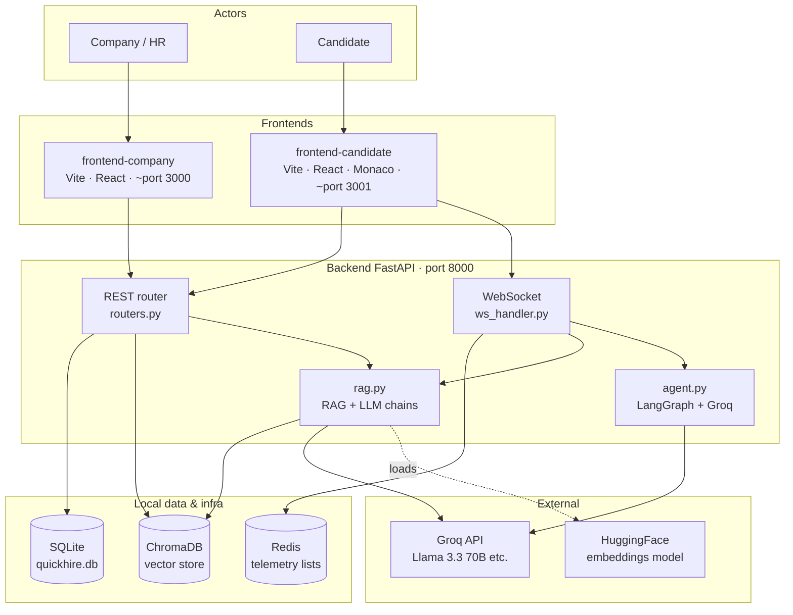

**Legend**

| Edge | Meaning |
|------|---------|
| `REST` | HTTP JSON; durable interview/session state |
| `WS` | Real-time telemetry + assistant chat |
| `RAG` | Chroma + LangChain `ChatGroq` (and optional `ChatOpenAI`) |
| `AG` | LangGraph state machine + `ChatGroq` (reserved / alternate path) |

---

## 2. Orchestration layers

The backend stacks **transport**, **business logic**, and **model orchestration** in distinct layers.

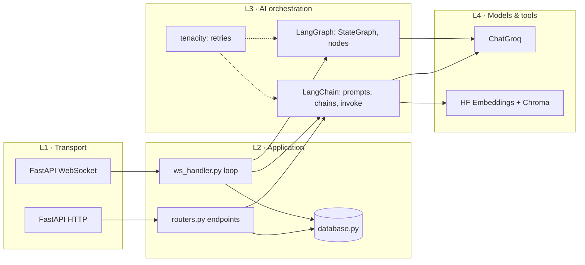

**Responsibilities (explicit)**

| Layer | Module(s) | Responsibility |
|-------|-----------|----------------|
| L1 | `main.py` | App factory, CORS, router mount, DB init on lifespan |
| L2 | `routers.py`, `ws_handler.py`, `database.py` | Auth-less demo CRUD, session lifecycle, WS message typing |
| L3 | `rag.py`, `agent.py` | Prompt templates, message lists, graph execution, parsing LLM output |
| L4 | `langchain_groq`, `langchain_chroma`, `langchain_huggingface` | Model I/O, vector persistence |

---

## 3. LLM call inventory

Every **Groq (or optional OpenAI)** touchpoint, with **trigger**, **module**, **wrapper**, and **default model behavior**.

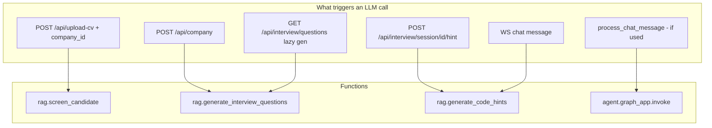

### 3.1 Summary table

| # | Entrypoint | Function | Primary model (default) | Temperature (typical) | Output shape |
|---|------------|----------|-------------------------|------------------------|--------------|
| 1 | `POST /api/upload-cv` (with `company_id`) | `rag.screen_candidate` | `llama-3.3-70b-versatile` | 0.1 | JSON dict: score, verdict, skills, reasoning |
| 2 | `POST /api/company`, lazy question fetch | `rag.generate_interview_questions` | same | 0.7 | List of question objects (MCQ + coding) |
| 3 | `POST .../hint` (REST) | `rag.generate_code_hints` | same (or BYO) | 0.55 | Plain text hint |
| 4 | `WS` `type: chat` | `rag.generate_code_hints` | same (or BYO) | 0.55 | Plain text (sent as `chat_response`) |
| 5 | `agent.process_chat_message` | LangGraph → `socratic_hint_agent` | same | 0.2 | Plain text reply |

**Interview report completion** (`POST .../complete`): the code comment references Groq, but **scoring and feedback strings are rule-based** (MCQ correctness, submission flag, telemetry heuristics). There is **no additional LLM call** there today.

### 3.2 Model selection inside `generate_code_hints`

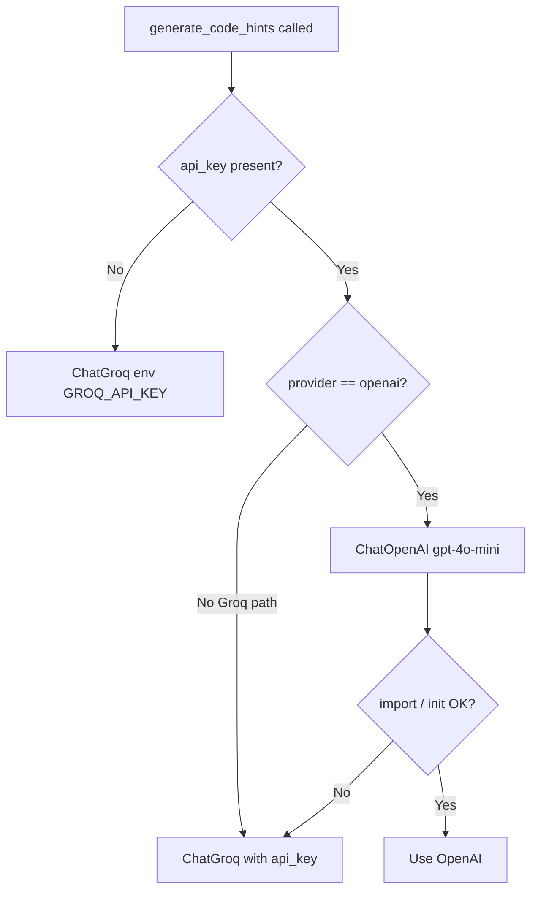

---

## 4. RAG and embeddings pipeline

**Retrieval-Augmented Generation** here means: **chunk CVs → embed → store in Chroma → (optional) similarity search**; **screening** uses **full extracted PDF text** passed to Groq, not only top-k chunks.

### 4.1 Ingestion flow

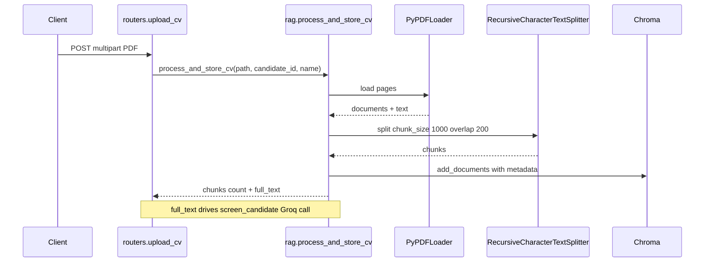

### 4.2 Embedding model (no LLM)

| Component | Value |
|-----------|--------|
| Class | `HuggingFaceEmbeddings` |
| Model id | `all-MiniLM-L6-v2` |
| Vector store | `Chroma` with `persist_directory=CHROMA_DB_PATH` |
| Chunking | `RecursiveCharacterTextSplitter`, size 1000, overlap 200 |

### 4.3 Semantic search (available API)

`rag.search_candidates(job_description, n_results)` runs **similarity_search_with_score** over Chroma and deduplicates by `candidate_id`. Wire this to a dashboard endpoint if you want “find similar CVs to this JD.”

---

## 5. REST-driven LLM flows

### 5.1 Company creation → question generation

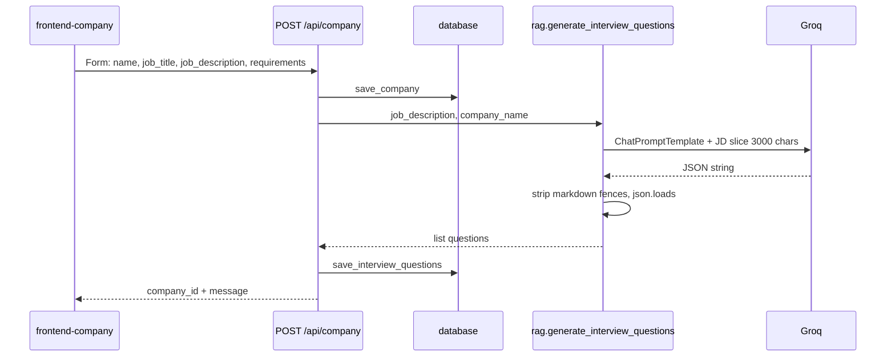

**Orchestration detail:** Question generation uses a **single-shot** `ChatPromptTemplate | ChatGroq` chain (`_llm_call`), not LangGraph. Creative variance is higher (`temperature=0.7`).

### 5.2 CV upload → screening

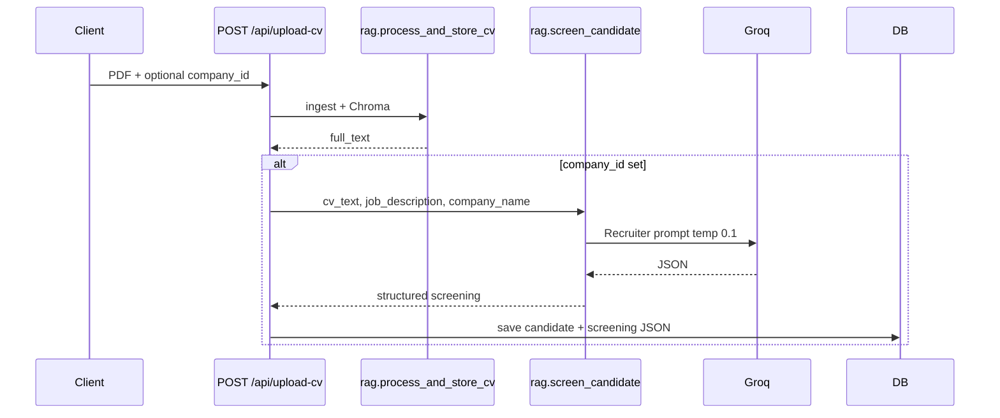

**Orchestration detail:** Screening uses **low temperature (0.1)** for stable JSON-style behavior.

### 5.3 REST hint endpoint (alternate to WebSocket)

`POST /api/interview/session/{session_id}/hint` with query params resolves the **coding** question from DB and calls `generate_code_hints` with that question text as `problem_description`. It increments `hints_used` on the session (see `database.update_interview_session` in flow).

---

## 6. WebSocket interview orchestration

**Route:** `WS /ws/interview/{session_id}` (`ws_handler.py`).

### 6.1 Message types (orchestration diagram)

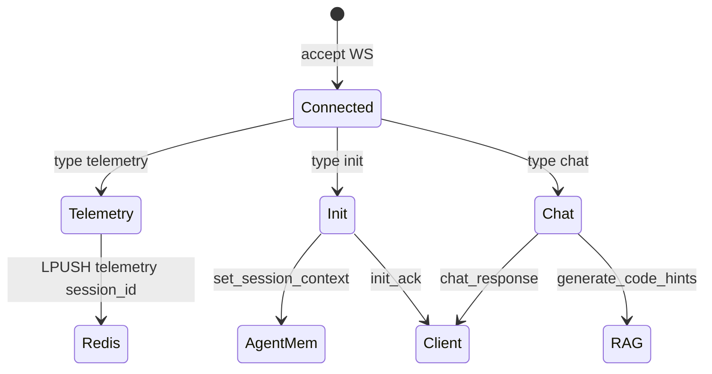

| `type` | Handler action | Side effects |
|--------|----------------|--------------|
| `telemetry` | `redis.lpush("telemetry:{session_id}", json)` | Events in Redis list (consumer not shown in-stack) |
| `init` | Load company by `company_id`; build string; `set_session_context(session_id, ctx)` | In-memory dict in `agent.py` |
| `chat` | `rag.generate_code_hints(editor_code, get_session_context(...), user_msg, ...)` | Groq/OpenAI call; error string on failure |

### 6.2 Session context string format (after `init`)

Exact f-string from `ws_handler.py`:

```
Company: {name}
Role: {job_title}
Description: {job_description}
```

This becomes the **`problem_description`** argument to `generate_code_hints` (truncated to 6000 chars inside the user message body).

### 6.3 Chat payload (recommended client shape)

| Field | Role |
|-------|------|
| `message` | Candidate question only |
| `editor_code` | Full Monaco buffer snapshot |
| `api_key` | Optional BYO key |
| `provider` | `"groq"` (default) or `"openai"` |

**Frontend note:** `frontend-candidate/src/App.tsx` currently uses a **`MockWebSocket`** that simulates canned responses and never opens `ws://localhost:8000/ws/interview/...`. Telemetry may still be **`POST`**ed to REST. For end-to-end Groq hints over WS, replace the mock with a native `WebSocket` and send `init` after connect.

### 6.4 Sequence: real WebSocket chat (intended)

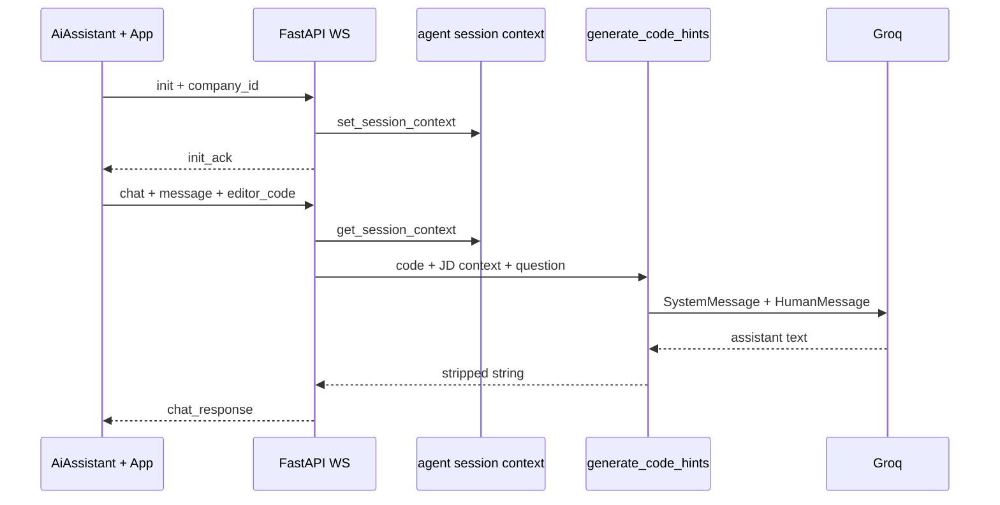

---

## 7. LangGraph agent (Socratic graph)

**File:** `agent.py`.

### 7.1 Graph topology

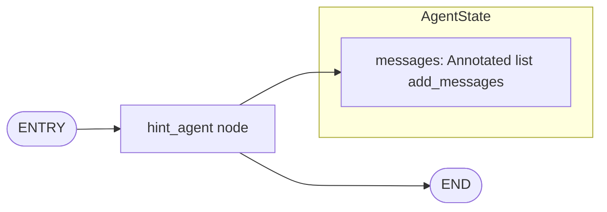

**This is a single-node graph:** entry → `socratic_hint_agent` → END. There is no branching, tool-calling, or ReAct loop in this module (unlike heavier hiring graphs in separate reference projects).

### 7.2 State definition

| Field | Type | Reducer |
|-------|------|---------|
| `messages` | `list` | `add_messages` from LangGraph (appends new AI/Human/System messages) |

### 7.3 Node behavior (`socratic_hint_agent`)

1. Takes `state["messages"]`.
2. If no `SystemMessage` yet, prepends `_build_system_prompt()` (optionally empty company block).
3. Invokes `ChatGroq(model_name="llama-3.3-70b-versatile", temperature=0.2)` with full message list.
4. Returns `{"messages": [response]}`.

### 7.4 `process_chat_message` orchestration

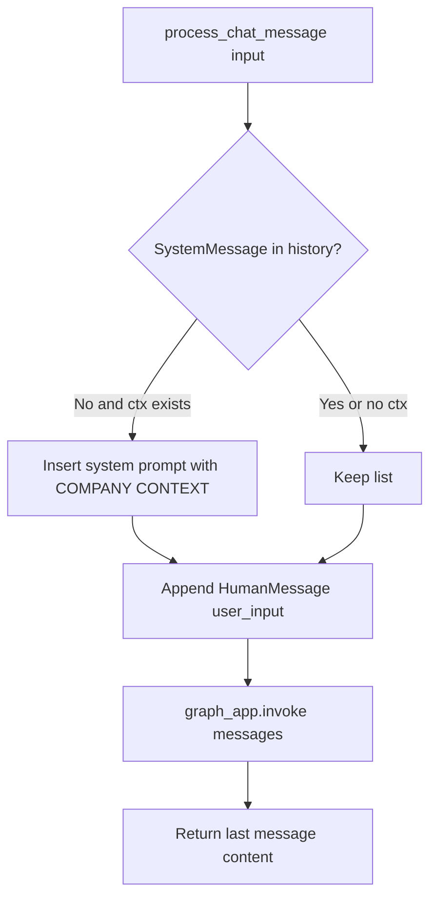

**Current WS path:** WebSocket **`chat`** uses **`rag.generate_code_hints`**, not `process_chat_message`. LangGraph remains available for future multi-turn chat history or server-side tooling.

---

## 8. Prompt and message construction

### 8.1 Screening (`screen_candidate`)

- **Pattern:** `ChatPromptTemplate.from_template(...)` → `ChatGroq`
- **Role:** “elite AI Technical Recruiter” for `{company}`
- **Structured output:** JSON keys `match_score`, `verdict`, `matching_skills`, `missing_skills`, `reasoning`, `recommended_questions`
- **Post-process:** Strip markdown code fences; `json.loads`; fallback dict on failure

### 8.2 Interview questions (`generate_interview_questions`)

- **Pattern:** Template chain
- **Output contract:** Exactly **4** questions in JSON: **3 × `mcq`**, **1 × `coding`** with `starter_code`, `test_cases`, etc.
- **JD truncation:** `job_description[:3000]`

### 8.3 Hints (`generate_code_hints`)

- **Pattern:** **Chat messages**, not a template chain:
  - `SystemMessage(INTERVIEW_HINT_SYSTEM)` — long integrity / no-solution policy
  - `HumanMessage` built from three blocks:
    1. Role/problem context (**≤ 6000** chars)
    2. IDE contents in a fenced code block (**≤ 12000** chars)
    3. Candidate question (**≤ 4000** chars)

The system prompt text is defined in `rag.py` as **`INTERVIEW_HINT_SYSTEM`** (markdown emphasis in text is sent as-is to the model).

### 8.4 LangGraph system prompt (`_build_system_prompt`)

Short Socratic mentor instructions; max **3 sentences** in instructions; appends raw `COMPANY CONTEXT` block when `set_session_context` populated.

---

## 9. Reliability: retries and fallbacks

| Mechanism | Where | Policy |
|-----------|-------|--------|
| `@retry` + `_llm_call` | `rag.py` screening, questions | 3 attempts, exponential backoff 1–15s |
| `@retry` + `_hint_llm_invoke` | `rag.py` hints | 3 attempts, 1–15s |
| `@retry` + `_call_groq` | `agent.py` graph node | 5 attempts, 2–30s |
| JSON parse failure | `screen_candidate`, `generate_interview_questions` | Fallback empty list or error-shaped dict |
| OpenAI import failure in hints | `generate_code_hints` | Fallback to `ChatGroq(api_key=...)` |
| WS Groq failure | `ws_handler.py` | Catch-all → user-visible error string with exception type name |

---

## 10. Configuration and secrets

| Variable | Purpose |
|----------|---------|
| `GROQ_API_KEY` | Default Groq authentication (`config.py` sets `os.environ` for LangChain) |
| `REDIS_HOST`, `REDIS_PORT` | Redis for WS telemetry lists |
| `CHROMA_DB_PATH` | Chroma persistence directory |
| `SQLITE_DB_PATH` | SQLite file; relative paths resolved under `backend/` |

**Never commit** real `.env` files; use `.gitignore` patterns at repo root.

---

## 11. Running locally

| Service | Command | Port |
|---------|---------|------|
| Backend | `cd backend && source venv/bin/activate && uvicorn main:app --reload` | 8000 |
| Company UI | `cd frontend-company && npm run dev` | 3000 |
| Candidate UI | `cd frontend-candidate && npm run dev` | 3001 |

**Dependencies:** Redis optional for strict telemetry queue behavior; Groq key required for real LLM output.

---

## 12. Known gaps and documentation debt

| Item | Detail |
|------|--------|
| **Mock WebSocket** | Candidate app does not hit FastAPI WS for chat unless you replace `MockWebSocket`. |
| **`complete` vs Groq** | Comment in `routers.py` says “Generate report using Groq”; implementation is heuristic scoring only. |
| **LangGraph vs hints** | WS chat uses `generate_code_hints`; LangGraph in `agent.py` is a separate, extensible path. |
| **`process_chat_message`** | Not wired to current WS handler; kept for LangGraph extension. |
| **Hint REST vs WS** | Both call the same `generate_code_hints`; REST also bumps `hints_used`. |
| **Code execution** | `CodeEditor` “run tests” / submit are stubs; evaluation is not a sandboxed runner in-repo. |

---

## Quick reference: file map (AI-related)

| File | AI / orchestration role |
|------|-------------------------|
| `backend/rag.py` | Chroma, embeddings, CV ingest, screening chain, question chain, **hint messages** + `INTERVIEW_HINT_SYSTEM` |
| `backend/agent.py` | LangGraph `StateGraph`, session context dict, `ChatGroq` Socratic node |
| `backend/ws_handler.py` | WS loop, Redis telemetry, `init` → context, `chat` → `generate_code_hints` |
| `backend/routers.py` | REST triggers for screening, questions, optional REST hint, **non-LLM** report |
| `backend/config.py` | Env + SQLite path normalization |
| `frontend-candidate/src/components/AiAssistant.tsx` | Chat UI + payload shape |
| `frontend-candidate/src/App.tsx` | Telemetry merge + **MockWebSocket** |

---

*README generated to match the QuickHire repository structure. If diagrams fail to render, use a Markdown viewer with Mermaid support (GitHub, many IDEs, or `mermaid-cli`).*
