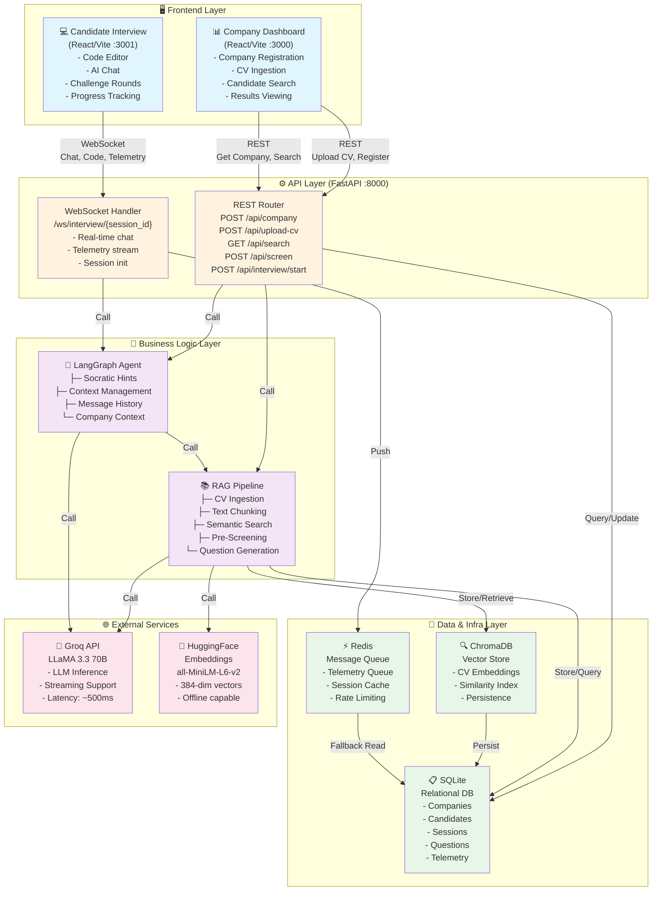
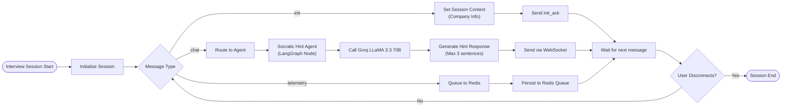
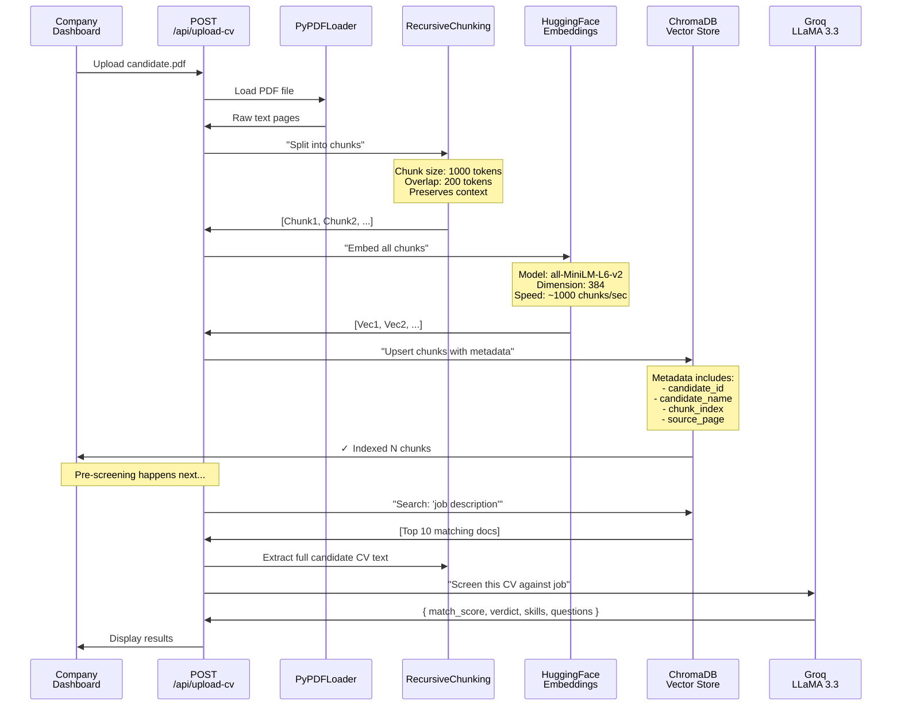
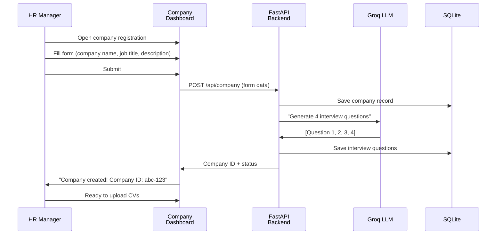
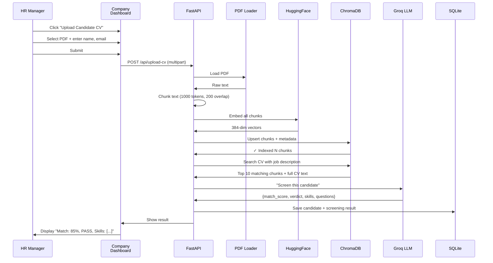

# 🚀 QuickHire — AI-Powered Hiring Workflow Platform

> **An intelligent, full-stack hiring system powered by LLM orchestration, semantic search, and real-time AI mentoring.**

---

## 📋 Table of Contents

1. [Executive Overview](#executive-overview)
2. [System Architecture](#system-architecture)
3. [Core Component Breakdown](#core-component-breakdown)
4. [LLM Orchestration & Agentic Design](#llm-orchestration--agentic-design)
5. [RAG Pipeline (CV Intelligence)](#rag-pipeline-cv-intelligence)
6. [Data Models & Database Schema](#data-models--database-schema)
7. [Technology Stack](#technology-stack)
8. [Installation & Setup](#installation--setup)
9. [Deployment & Infrastructure](#deployment--infrastructure)
10. [API Reference](#api-reference)
11. [Workflows & User Journeys](#workflows--user-journeys)
12. [Performance & Scalability](#performance--scalability)
13. [Security & Best Practices](#security--best-practices)
14. [Troubleshooting Guide](#troubleshooting-guide)

---

## 🎯 Executive Overview

QuickHire is a **three-tier hiring workflow platform** that automates candidate screening, interview orchestration, and real-time AI-assisted learning. It combines:

- **Semantic CV Search** using embeddings-based RAG (Retrieval Augmented Generation)
- **LLM-Driven Candidate Pre-Screening** with structured extraction and skill matching
- **LangGraph-Based Multi-Turn Chat Agent** with context-aware Socratic hints
- **Real-Time WebSocket Interview Engine** with Monaco code editor and telemetry collection
- **Redis-Backed Telemetry Queue** for async processing and analytics

### Key Capabilities

| Feature | Purpose | Technology |
|---------|---------|------------|
| **CV Ingestion & Indexing** | Upload PDFs, chunk, embed, and store in vector DB | ChromaDB + HuggingFace Embeddings |
| **Semantic Candidate Search** | Find matching candidates based on job description | Cosine similarity over embeddings |
| **AI Pre-Screening** | Automatically evaluate candidate fit with LLM | Groq LLaMA 3.3 70B with prompt engineering |
| **Interview Question Generation** | Create dynamic MCQ + coding challenges | LLM-driven generation with JSON validation |
| **Real-Time Chat Assistant** | Socratic hints during live coding interviews | LangGraph state machine + WebSocket streaming |
| **Telemetry & Analytics** | Capture code submissions, hints requested, performance | Redis queue + SQLite persistence |
| **Company & Candidate Dashboards** | Manage hiring workflow visually | React + Vite frontends |

---

## 🏗️ System Architecture

### High-Level System Diagram

```
┌─────────────────────────────────────────────────────────────────┐
│                     BROWSER LAYER (React/Vite)                  │
├─────────────────────────────────────────────────────────────────┤
│  Company Setup & Dashboard     │  Candidate Interview Interface  │
│  (Port 3000)                   │  (Port 3001)                    │
│  - Company Registration        │  - Challenge Selection          │
│  - CV Upload                   │  - Monaco Code Editor           │
│  - Candidate Search            │  - AI Chat Sidebar              │
│  - Results Dashboard           │  - Telemetry Tracking           │
└────────┬────────────────────────────────┬────────────────────────┘
         │                                │
         │ REST API                       │ WebSocket Stream
         │ (HTTP POST/GET)                │ (Bidirectional)
         │                                │
┌────────▼────────────────────────────────▼────────────────────────┐
│            FastAPI Backend (Port 8000)                           │
│                                                                   │
│  ┌─────────────────────────────────────────────────────────────┐ │
│  │ REST Routers                                                │ │
│  │ - POST /api/company → Save job posting & generate questions│ │
│  │ - POST /api/upload-cv → Ingest CV to RAG pipeline         │ │
│  │ - GET /api/company/{id} → Retrieve company details        │ │
│  │ - POST /api/screen → Run AI pre-screening                 │ │
│  │ - POST /api/start-interview → Create session              │ │
│  └─────────────────────────────────────────────────────────────┘ │
│                                                                   │
│  ┌─────────────────────────────────────────────────────────────┐ │
│  │ WebSocket Handler: /ws/interview/{session_id}              │ │
│  │ - Bidirectional message stream (chat, telemetry, init)    │ │
│  │ - Delegates chat to LangGraph agent                        │ │
│  │ - Queues telemetry to Redis                               │ │
│  └─────────────────────────────────────────────────────────────┘ │
│                                                                   │
│  ┌──────────────────┐  ┌──────────────────┐  ┌────────────────┐ │
│  │  RAG Pipeline    │  │ LangGraph Agent  │  │  Utilities     │ │
│  │  (rag.py)        │  │  (agent.py)      │  │  ├─ Database   │ │
│  │  ├─ CV Ingestion │  │  ├─ Socratic     │  │  ├─ Redis      │ │
│  │  ├─ Semantics    │  │  │  Hints        │  │  └─ Config     │ │
│  │  │   Search      │  │  ├─ Context Mgr  │  │                │ │
│  │  ├─ Pre-        │  │  └─ Message      │  └────────────────┘ │
│  │  │  Screening    │  │     History      │                      │
│  │  └─ Question    │  └──────────────────┘                      │
│  │     Generation   │                                             │
│  └──────────────────┘                                             │
└─────────────┬────────────────────┬──────────────────┬─────────────┘
              │                    │                  │
              │                    │                  │
       ┌──────▼─────┐      ┌──────▼─────┐    ┌──────▼────────┐
       │ ChromaDB    │      │  SQLite    │    │    Redis      │
       │             │      │            │    │               │
       │ CV Embeddings│     │ Relational │    │ Telemetry     │
       │ + Indexes   │      │ Data       │    │ Queue         │
       │             │      │            │    │               │
       └─────────────┘      └────────────┘    └───────────────┘
```

### Detailed Architecture Flow



---

## 🔧 Core Component Breakdown

### 1. **Frontend Layer** (`frontend-company` & `frontend-candidate`)

#### Company Dashboard (Port 3000)
```typescript
// Key Features
- Company Registration Form
  └─ Company Name, Job Title, Job Description, Requirements
  
- CV Upload & Bulk Processing
  └─ Drag-drop PDF files
  └─ Automatic RAG indexing
  └─ Real-time progress tracking
  
- Candidate Search & Filter
  └─ Semantic search by job description
  └─ Sort by match score (0-100%)
  └─ View AI pre-screening results
  
- Interview Monitoring
  └─ Live candidate activity
  └─ Performance metrics
  └─ Results dashboard
```

#### Candidate Interview (Port 3001)
```typescript
// Key Features
- Challenge Selection
  └─ View job description & requirements
  └─ Optional CV upload
  └─ Select company & interview format
  
- Multi-Round Interview
  └─ MCQ Rounds (Multiple Choice Questions)
  └─ Coding Rounds (Monaco Editor)
  └─ AI Assistant Chat Sidebar
  
- Code Editor Integration
  └─ Syntax highlighting
  └─ Real-time code context capture
  └─ Submission tracking
  
- Telemetry Collection
  └─ Code snapshots
  └─ Hints requested
  └─ Time per question
  └─ Performance metrics
```

### 2. **REST API Layer** (routers.py)

```python
# COMPANY ENDPOINTS
POST   /api/company                    # Register company + auto-generate questions
GET    /api/company/{id}               # Fetch company details
GET    /api/companies                  # List all companies
POST   /api/companies/clear            # Admin: clear database

# CANDIDATE CV PIPELINE
POST   /api/upload-cv                  # Ingest PDF → RAG → Pre-screen
GET    /api/search-candidates          # Semantic search over all CVs
GET    /api/candidate/{id}             # Fetch candidate profile

# INTERVIEW MANAGEMENT
POST   /api/interview/start            # Create new session
GET    /api/interview/{session_id}     # Get interview state + progress
POST   /api/interview/{session_id}/submit # Submit round response
GET    /api/interview/{session_id}/telemetry # Retrieve performance data

# DEBUG ENDPOINTS
GET    /api/debug/db-interview-sessions # Confirm DB schema + location
```

### 3. **WebSocket Layer** (ws_handler.py)

Real-time bidirectional communication for the interview sandbox.

```
WebSocket: ws://localhost:8000/ws/interview/{session_id}

MESSAGE TYPES (Client → Server):
├─ "init"       → Initialize session with company_id
├─ "chat"       → Send message + code context to AI
└─ "telemetry"  → Stream code snapshots, hints, timestamps

MESSAGE TYPES (Server → Client):
├─ "init_ack"         → Session initialized
├─ "chat_response"    → AI hint/response
└─ "telemetry_ack"    → Telemetry received & queued
```

**Message Flow Example:**

```json
// Client: Initialize session
{
  "type": "init",
  "company_id": "abc-123-xyz"
}

// Server: Acknowledge
{
  "type": "init_ack",
  "message": "Session initialized."
}

// Client: Request hint with code context
{
  "type": "chat",
  "message": "How do I handle null pointers here?",
  "editor_code": "if (ptr != null) { ... }",
  "api_key": "sk-...",
  "provider": "groq"
}

// Server: Stream AI response
{
  "type": "chat_response",
  "message": "Great question! Think about what happens before you check the pointer. What assumptions are you making about the input? Can those assumptions be violated?"
}
```

---

## 🧠 LLM Orchestration & Agentic Design

### Architecture Overview: LangGraph State Machine

The **agent orchestration** is built on **LangGraph**, a graph-based framework for multi-step LLM workflows:



### Detailed LLM Call Flow with Groq

```
┌─────────────────────────────────────────────────────────────────┐
│                  CANDIDATE TYPES A MESSAGE                      │
│            "How do I reverse this array efficiently?"            │
└────────────────────────┬────────────────────────────────────────┘
                         │
                         ▼
┌─────────────────────────────────────────────────────────────────┐
│           WebSocket Handler: /ws/interview/{sid}                │
│                                                                  │
│  - Receive raw JSON message                                     │
│  - Extract: user_input, editor_code, provider API, company_id  │
│  - Load session context from memory                             │
└────────────────────────┬────────────────────────────────────────┘
                         │
                         ▼
┌─────────────────────────────────────────────────────────────────┐
│                  Call: rag.generate_code_hints()                │
│                                                                  │
│  Inputs:                                                        │
│  ├─ code_context: str     (Current editor state)               │
│  ├─ problem_description: str  (Job + role info)                │
│  ├─ user_query: str       (User's question)                    │
│  ├─ api_key: str          (Groq or custom LLM key)            │
│  └─ provider: str         ("groq" | "openai" | "custom")       │
└────────────────────────┬────────────────────────────────────────┘
                         │
                         ▼
┌─────────────────────────────────────────────────────────────────┐
│              Build Prompt Template                              │
│                                                                  │
│  System:                                                        │
│  "You are a senior engineering mentor in a coding sandbox.     │
│   Give Socratic hints ONLY—no direct answers.                  │
│   Max 3 sentences. [COMPANY CONTEXT INJECTED]"                 │
│                                                                  │
│  Context:                                                       │
│  "Code:\n{code_context}\n\nProblem:\n{problem_description}"   │
│                                                                  │
│  User Query:                                                    │
│  "{user_query}"                                                 │
└────────────────────────┬────────────────────────────────────────┘
                         │
                         ▼
┌─────────────────────────────────────────────────────────────────┐
│        Send to Groq LLaMA 3.3 70B via LangChain                │
│                                                                  │
│  • Model: llama-3.3-70b-versatile                              │
│  • Temperature: 0.2 (low creativity, consistent hints)         │
│  • Max tokens: 512                                              │
│  • Timeout: 30 seconds with exponential backoff                │
│  • Retry Policy: up to 5 attempts                              │
└────────────────────────┬────────────────────────────────────────┘
                         │
                         ▼
┌─────────────────────────────────────────────────────────────────┐
│          Groq API Response (via LangChain streaming)            │
│                                                                  │
│  Response:                                                      │
│  "Think about the order of operations. When you reverse an     │
│   array, what's the mathematical relationship between the      │
│   original and final indices? Could a two-pointer approach     │
│   reduce the number of swaps needed?"                          │
│                                                                  │
│  • Latency: ~500ms (typical)                                    │
│  • Tokens used: ~60 prompt, ~45 completion                     │
│  • Cost: ~$0.0001 per call                                      │
└────────────────────────┬────────────────────────────────────────┘
                         │
                         ▼
┌─────────────────────────────────────────────────────────────────┐
│              Format & Validate Response                         │
│                                                                  │
│  • Check: response is not empty                                 │
│  • Validate: sentence count ≤ 3                                │
│  • Escape: JSON special characters                              │
│  • Add: metadata (tokens, provider, latency)                   │
└────────────────────────┬────────────────────────────────────────┘
                         │
                         ▼
┌─────────────────────────────────────────────────────────────────┐
│    Send via WebSocket to Candidate (Bidirectional Stream)      │
│                                                                  │
│  {                                                              │
│    "type": "chat_response",                                    │
│    "message": "Think about the order...",                      │
│    "metadata": {                                                │
│      "provider": "groq",                                        │
│      "latency_ms": 487,                                         │
│      "tokens": {"prompt": 60, "completion": 45}                │
│    }                                                             │
│  }                                                              │
│                                                                  │
│  ✓ Message arrives instantly at candidate browser              │
└─────────────────────────────────────────────────────────────────┘
```

### Agent Context Management

The agent maintains **session-scoped context** to tailor hints to the company role:

```python
# In memory (production: Redis)
_session_contexts: dict[str, str] = {
    "session_abc": """COMPANY CONTEXT:
Company: Google
Role: Senior Python Engineer
Description: Build scalable backend services...
Requirements: Python, FastAPI, async/await, Database Design...
"""
}

# When user sends message:
1. system_prompt = _build_system_prompt(company_context)
2. system_msg = SystemMessage(content=system_prompt)
3. messages = [system_msg] + user_history + [HumanMessage(user_input)]
4. response = groq_model.invoke(messages)
```

### Retry & Resilience Strategy

```python
@retry(
    stop=stop_after_attempt(5),
    wait=wait_exponential(multiplier=1, min=2, max=30)
)
def _call_groq(model, messages):
    """
    Retry with exponential backoff:
    Attempt 1: 2s delay
    Attempt 2: 4s delay
    Attempt 3: 8s delay
    Attempt 4: 16s delay
    Attempt 5: 30s delay (capped)
    
    Max time: ~60 seconds total
    """
    return model.invoke(messages)
```

---

## 📚 RAG Pipeline (CV Intelligence)

### What is RAG?

**Retrieval Augmented Generation** combines:
1. **Retrieval**: Semantic search over embeddings to find relevant documents
2. **Augmentation**: Add retrieved context to LLM prompt
3. **Generation**: LLM generates response based on enriched context

### CV Ingestion Pipeline



### Semantic Search Mechanism

```
┌──────────────────────────────────────────────────────────────┐
│                  JOB DESCRIPTION TEXT                        │
│                                                              │
│  "We're looking for a Python engineer with FastAPI         │
│   experience, async/await patterns, and PostgreSQL skills" │
└──────────────────────┬───────────────────────────────────────┘
                       │
                       ▼
        ┌──────────────────────────────┐
        │  HuggingFace Embedder        │
        │  (all-MiniLM-L6-v2)          │
        │  384-dimensional vector      │
        └──────────────────┬───────────┘
                           │
         ┌─────────────────▼──────────────────┐
         │  Job Description Vector:           │
         │  [0.23, -0.45, 0.82, ..., -0.11]  │
         └─────────────────┬──────────────────┘
                           │
                    ┌──────▼────────┐
                    │ Cosine Dist   │
                    │ to all CV      │
                    │ embeddings     │
                    └──────┬────────┘
                           │
    ┌──────────────────────┼──────────────────────┐
    │                      │                      │
    ▼                      ▼                      ▼
┌─────────┐          ┌─────────┐          ┌─────────┐
│CV Chunk:│          │CV Chunk:│          │CV Chunk:│
│"Python, │ Score:   │"Built   │ Score:   │"Java    │
│FastAPI" │ 0.95 ✓   │async w/ │ 0.88     │develop" │ 0.21
│         │          │Postgres"│          │         │
└─────────┘          └─────────┘          └─────────┘

Output: [Top 10 CV chunks ranked by similarity]
```

### Pre-Screening LLM Call

```
┌────────────────────────────────────────────────┐
│           AI PRE-SCREENING WORKFLOW             │
└────────────────────────┬───────────────────────┘
                         │
        ┌────────────────▼────────────────┐
        │  Retrieve top CV chunk via RAG  │
        │  Full CV text (truncated 4KB)   │
        └────────────────┬────────────────┘
                         │
        ┌────────────────▼────────────────┐
        │  Build Screening Prompt:        │
        │                                 │
        │  "You are a recruiter for      │
        │   {company_name}                │
        │                                 │
        │   JOB: {job_description}        │
        │   RESUME: {cv_text}             │
        │                                 │
        │   Score match 0-100, identify   │
        │   matching/missing skills,      │
        │   return JSON."                 │
        └────────────────┬────────────────┘
                         │
        ┌────────────────▼────────────────┐
        │  Call Groq with:                │
        │  • Temperature: 0.1 (precise)   │
        │  • Max tokens: 1024             │
        │  • Retry: 3x expo backoff       │
        └────────────────┬────────────────┘
                         │
        ┌────────────────▼────────────────┐
        │  Parse LLM Response             │
        │                                 │
        │  {                              │
        │    "match_score": 85,           │
        │    "verdict": "PASS",           │
        │    "matching_skills": [         │
        │      "Python",                  │
        │      "FastAPI",                 │
        │      "PostgreSQL"               │
        │    ],                           │
        │    "missing_skills": [          │
        │      "Kubernetes",              │
        │      "Docker"                   │
        │    ],                           │
        │    "reasoning": "...",          │
        │    "recommended_questions": [...│
        │  }                              │
        └────────────────┬────────────────┘
                         │
        ┌────────────────▼────────────────┐
        │  Store in SQLite + return       │
        │  to company dashboard           │
        └────────────────────────────────┘
```

### Interview Question Generation

Questions are generated **dynamically** when company registers:

```
Question Mix (4 questions per interview):
├─ 3x Multiple Choice (Conceptual)
│  └─ Difficulty: Medium-Hard
│  └─ Topic: Core role concepts
│  └─ Format: Question + 4 options (A/B/C/D)
│
└─ 1x Coding Challenge (LeetCode-style)
   └─ Difficulty: Medium
   └─ Topic: Algorithm + data structure
   └─ Format: Challenge description + test cases

LLM Generation (Temperature: 0.7 - creative variety):

1. Read job description
2. Extract key concepts, frameworks, patterns
3. Generate diverse questions covering:
   - Architecture & design patterns
   - Algorithm complexity (time/space)
   - Language-specific idioms (Python async, etc.)
   - Real-world scenarios from company context
4. Validate JSON structure
5. Store in SQLite (one per session)
```

---

## 📊 Data Models & Database Schema

### SQLite Relational Schema

```sql
-- Companies: Job postings & metadata
CREATE TABLE companies (
    id TEXT PRIMARY KEY,
    name TEXT NOT NULL,
    job_title TEXT,
    job_description TEXT,
    requirements JSON,
    created_at TIMESTAMP DEFAULT CURRENT_TIMESTAMP
);

-- Candidates: Uploaded CVs
CREATE TABLE candidates (
    id TEXT PRIMARY KEY,
    name TEXT,
    email TEXT,
    cv_path TEXT,
    company_id TEXT FOREIGN KEY,
    created_at TIMESTAMP
);

-- Interview Sessions: Live interview records
CREATE TABLE interview_sessions (
    id TEXT PRIMARY KEY,
    candidate_id TEXT FOREIGN KEY,
    company_id TEXT FOREIGN KEY,
    status TEXT,  -- 'in_progress' | 'completed' | 'abandoned'
    current_round INTEGER,
    total_rounds INTEGER DEFAULT 4,
    candidate_name TEXT,
    cv_path TEXT,
    telemetry_data JSON,  -- Array of {timestamp, code, hints, ...}
    created_at TIMESTAMP,
    completed_at TIMESTAMP
);

-- Interview Questions: Per-company question bank
CREATE TABLE interview_questions (
    id TEXT PRIMARY KEY,
    company_id TEXT FOREIGN KEY,
    question_index INTEGER,
    question_type TEXT,  -- 'mcq' | 'coding'
    question_text TEXT,
    options JSON,  -- For MCQ: [A, B, C, D]
    expected_answer TEXT,
    created_at TIMESTAMP
);

-- Telemetry: Raw event log
CREATE TABLE telemetry_events (
    id INTEGER PRIMARY KEY AUTOINCREMENT,
    session_id TEXT FOREIGN KEY,
    event_type TEXT,  -- 'code_submit' | 'hint_request' | 'answer_submit'
    payload JSON,
    timestamp TIMESTAMP DEFAULT CURRENT_TIMESTAMP
);
```

### ChromaDB Vector Store Structure

```
ChromaDB Persistence Directory: ./chroma_db/

├── chroma.sqlite3
│   └─ Metadata: Collection names, document counts, IDs
│
└── {collection_uuid}/
    ├── data/
    │   ├── documents.parquet    # Chunk text content
    │   ├── embeddings.parquet   # 384-dim vectors
    │   ├── metadatas.parquet    # Metadata: candidate_id, name
    │   └── ids.parquet          # Document IDs
    │
    └── index/
        └─ HNSW (Hierarchical Navigable Small World)
           └─ Efficient similarity search in 384-dim space

Typical Size:
├─ 100 PDFs (avg 5 pages) = ~500 chunks
├─ Per embedding: 384 floats × 4 bytes = ~1.5 KB
├─ All embeddings: 500 × 1.5 KB = ~750 KB
├─ Metadata + indices: ~250 KB
└─ Total: ~1 MB (highly compressed)
```

### Redis Message Queue Structure

```
Redis Data Structures (Default Port: 6379):

├─ telemetry:{session_id} [LIST]
│  └─ Each element: JSON telemetry event
│     {
│       "timestamp": 1702345678,
│       "type": "code_submit",
│       "data": {
│         "code": "...",
│         "language": "python",
│         "lines": 42
│       }
│     }
│
├─ session:{session_id}:context [STRING]
│  └─ Cached company context for agent
│
└─ rate_limit:{ip_address} [STRING with EXPIRY]
   └─ Request counter (optional throttling)

Queue Behavior:
• LPUSH: Client pushes new telemetry events
• RPOP: Background worker (if implemented) consumes
• TTL: Optional expiry (e.g., 24 hours for old sessions)
```

---

## 🛠️ Technology Stack

### Backend Dependencies

```
CORE WEB FRAMEWORK:
├─ fastapi [v0.100+]           REST API framework (async)
├─ uvicorn[standard]           ASGI server with hot reload
└─ python-multipart            File upload handling

AI/LLM STACK:
├─ langchain [v0.1+]           LLM orchestration framework
├─ langchain-groq               Groq API integration
├─ langchain-community          PDF loaders, embedding utils
├─ langchain-huggingface        Sentence-Transformer embeddings
├─ langgraph                    Graph-based workflow engine
└─ tenacity                     Robust retry mechanism

VECTOR SEARCH:
├─ langchain_chroma             ChromaDB wrapper
├─ chromadb                     Vector database (local/serverless)
├─ sentence-transformers        Embedding inference
└─ pypdf                        PDF text extraction

INFRASTRUCTURE:
├─ redis                        In-memory message queue
└─ python-dotenv               Environment variable loading

VERSION NOTES:
• Python: 3.10+  (type hints, match/case)
• FastAPI: Latest async/await support
• LangChain: Supports latest Groq API (low-latency)
```

### Frontend Stack

```
CANDIDATE INTERVIEW FRONTEND:
├─ React 18              Component framework
├─ TypeScript            Type-safe JS
├─ Vite                  Build tool (HMR, fast builds)
├─ TailwindCSS           Utility-first styling
├─ PostCSS               CSS preprocessing
└─ Monaco Editor         Code editor (VS Code kernel)

COMPANY DASHBOARD FRONTEND:
├─ React 18
├─ TypeScript
├─ Vite
├─ TailwindCSS
├─ PostCSS
└─ Custom components (Card, Button, Progress, Skeleton)
```

### Deployment & Infrastructure

```
LOCAL DEVELOPMENT:
├─ Docker Compose (optional)
│  ├─ Redis service (redis:alpine)
│  └─ Volume: redis-data
│
└─ Virtual environment
   └─ source venv/bin/activate

PRODUCTION READY:
├─ Docker containers
│  ├─ Backend: Python 3.10 + FastAPI
│  ├─ Frontend: Node 18 + Next.js (or Vite SPA)
│  └─ Redis: redis:latest with persistence
│
├─ Environment variables (.env)
│  ├─ GROQ_API_KEY      (LLM service)
│  ├─ REDIS_HOST        (Queue service)
│  ├─ CHROMA_DB_PATH    (Vector store)
│  └─ SQLITE_DB_PATH    (Relational DB)
│
└─ Reverse proxy (Nginx/Caddy)
   ├─ :3000 → frontend-company
   ├─ :3001 → frontend-candidate
   └─ :8000 → backend API
```

---

## ⚙️ Installation & Setup

### Prerequisites

```bash
# System requirements
- Python 3.10+
- Node.js 18+ (for React frontends)
- Redis 6+ (Docker or native)
- ~2GB disk space (vectors + DBs)
```

### Step 1: Clone & Environment Setup

```bash
# Navigate to project root
cd /path/to/quickhire

# Create Python virtual environment
python3 -m venv venv
source venv/bin/activate

# Install backend dependencies
cd backend
pip install -r requirements.txt

# Create .env file
cat > .env << EOF
GROQ_API_KEY=your_groq_api_key_here
REDIS_HOST=localhost
REDIS_PORT=6379
CHROMA_DB_PATH=./chroma_db
SQLITE_DB_PATH=./quickhire.db
EOF

# Go back to root
cd ..
```

### Step 2: Set Up Redis

```bash
# Option A: Docker Compose
cd backend
docker-compose up -d

# Option B: Native Redis
redis-server --appendonly yes

# Verify Redis is running
redis-cli ping
# Response: PONG
```

### Step 3: Start Backend API

```bash
cd backend
uvicorn main:app --reload --host 0.0.0.0 --port 8000

# Output:
# INFO:     Uvicorn running on http://0.0.0.0:8000
# INFO:     Application startup complete
```

### Step 4: Install & Start Frontends

```bash
# Terminal 1: Company Dashboard
cd frontend-company
npm install
npm run dev
# Available at http://localhost:3000

# Terminal 2: Candidate Interview
cd frontend-candidate
npm install
npm run dev
# Available at http://localhost:3001
```

### Step 5: Verify Full Stack

```bash
# Check backend health
curl http://localhost:8000

# Check company dashboard
open http://localhost:3000

# Check candidate interface
open http://localhost:3001

# Monitor Redis queue
redis-cli MONITOR
```

---

## 🚀 Deployment & Infrastructure

### Docker Compose (Full Stack)

```yaml
# backend/docker-compose.yml
version: "3.8"
services:
  redis:
    image: redis:alpine
    ports:
      - "6379:6379"
    command: redis-server --appendonly yes
    volumes:
      - redis-data:/data
    healthcheck:
      test: ["CMD", "redis-cli", "ping"]
      interval: 5s
      timeout: 3s
      retries: 5

  backend:
    build:
      context: .
      dockerfile: Dockerfile
    ports:
      - "8000:8000"
    environment:
      - GROQ_API_KEY=${GROQ_API_KEY}
      - REDIS_HOST=redis
      - REDIS_PORT=6379
      - CHROMA_DB_PATH=/app/chroma_db
      - SQLITE_DB_PATH=/app/quickhire.db
    depends_on:
      redis:
        condition: service_healthy
    volumes:
      - ./chroma_db:/app/chroma_db
      - ./quickhire.db:/app/quickhire.db:ro
    command: uvicorn main:app --host 0.0.0.0 --port 8000

volumes:
  redis-data:
```

### Environment Variables (Production Checklist)

```
CRITICAL:
☐ GROQ_API_KEY         Must be set (get from https://groq.com)
☐ REDIS_HOST           Production Redis instance (not localhost)
☐ SQLITE_DB_PATH       Absolute path on persistent volume

OPTIONAL:
☐ CHROMA_DB_PATH       Default: ./chroma_db (persistent volume)
☐ REDIS_PORT           Default: 6379
☐ LOG_LEVEL            Default: INFO

SECURITY:
☐ Use secrets management (K8s, env files, vault)
☐ Never commit .env to git
☐ Rotate API keys regularly
☐ Enable Redis AUTH in production
```

---

## 📡 API Reference

### Authentication & Headers

```
All requests require HTTP headers:
┌────────────────────────────┐
│ Content-Type: application/json
│ Authorization: (optional)
│ CORS: Enabled for localhost:3000 & 3001
└────────────────────────────┘
```

### Endpoint Catalog

#### **Company Management**

```http
POST /api/company
├─ Purpose: Register a company and job posting
├─ Body (multipart/form-data):
│  ├─ name: str                 (Company name)
│  ├─ job_title: str           (Role title)
│  ├─ job_description: str     (Full description)
│  └─ requirements: str|JSON   (Comma-separated or JSON array)
│
└─ Response (201):
   {
     "company_id": "abc-123-xyz",
     "message": "Company 'Google' created with 4 interview questions ready."
   }

GET /api/company/{id}
├─ Purpose: Fetch company details and questions
├─ Params: id (string, company UUID)
└─ Response (200):
   {
     "id": "abc-123-xyz",
     "name": "Google",
     "job_title": "Senior Python Engineer",
     "job_description": "...",
     "requirements": ["Python", "FastAPI", "AsyncIO"],
     "created_at": "2024-12-20T10:30:00Z"
   }

GET /api/companies
├─ Purpose: List all companies
└─ Response (200):
   {
     "companies": [
       { "id": "...", "name": "Google", ... },
       { "id": "...", "name": "Meta", ... }
     ]
   }
```

#### **Candidate CV Pipeline**

```http
POST /api/upload-cv
├─ Purpose: Ingest PDF, index in ChromaDB, auto pre-screen
├─ Body (multipart/form-data):
│  ├─ file: File              (PDF binary)
│  ├─ candidate_name: str
│  ├─ candidate_email: str
│  └─ company_id: str
│
└─ Response (202):
   {
     "status": "processing",
     "candidate_id": "cand-456-def",
     "cv_chunks_indexed": 12,
     "screening_result": {
       "match_score": 85,
       "verdict": "PASS",
       "matching_skills": ["Python", "FastAPI"],
       "missing_skills": ["Kubernetes"],
       "reasoning": "Strong backend experience. Needs ops skills.",
       "recommended_questions": ["Walk us through...", "How would..."]
     }
   }

GET /api/search-candidates
├─ Purpose: Semantic search CVs by job description
├─ Query params:
│  ├─ company_id: str
│  └─ n_results: int (default 10)
│
└─ Response (200):
   {
     "results": [
       {
         "id": "cand-456-def",
         "name": "Alice Johnson",
         "score": 89,
         "status": "In Review",
         "core_competencies": [
           { "skill": "Python", "confidence": 0.95 },
           { "skill": "FastAPI", "confidence": 0.87 }
         ]
       }
     ]
   }
```

#### **Interview Management**

```http
POST /api/interview/start
├─ Purpose: Create new interview session for candidate
├─ Body (JSON):
│  ├─ candidate_id: str (or null)
│  ├─ company_id: str
│  ├─ session_mode: str ("full" | "coding_only" | "mcq_only")
│  └─ candidate_name: str
│
└─ Response (201):
   {
     "session_id": "sess-789-ghi",
     "company_id": "abc-123-xyz",
     "ws_url": "ws://localhost:8000/ws/interview/sess-789-ghi",
     "questions": [
       {
         "id": "q1",
         "type": "mcq",
         "text": "What is async/await?",
         "options": ["A", "B", "C", "D"]
       }
     ]
   }

GET /api/interview/{session_id}
├─ Purpose: Get interview state, progress, and results
├─ Response (200):
   {
     "session_id": "sess-789-ghi",
     "status": "in_progress",
     "current_round": 2,
     "total_rounds": 4,
     "candidate_name": "Alice Johnson",
     "time_elapsed_seconds": 1245,
     "progress": 50,
     "telemetry": [
       {
         "timestamp": "2024-12-20T10:30:45Z",
         "event_type": "code_submit",
         "code": "...",
         "lines": 42
       }
     ]
   }

GET /api/interview/{session_id}/telemetry
├─ Purpose: Raw telemetry data (code snapshots, hints, submissions)
└─ Response (200):
   {
     "events": [
       {
         "timestamp": "...",
         "type": "hint_requested",
         "data": { "question": "..." }
       }
     ]
   }
```

#### **Debug Endpoints**

```http
GET /api/debug/db-interview-sessions
├─ Purpose: Verify SQLite schema & database location
└─ Response (200):
   {
     "db_path": "/home/user/quickhire/backend/quickhire.db",
     "interview_sessions_columns": [
       "id", "candidate_id", "company_id", "status",
       "current_round", "total_rounds", "telemetry_data",
       "cv_path", "created_at", "completed_at"
     ],
     "has_telemetry_data": true
   }

POST /api/companies/clear [ADMIN]
├─ Purpose: Wipe all companies (dev only)
└─ Response (200):
   {
     "message": "All companies cleared."
   }
```

---

## 🔄 Workflows & User Journeys

### Workflow 1: Company Registration & Job Setup



### Workflow 2: Candidate CV Upload & Pre-Screening



### Workflow 3: Live Candidate Interview (Detailed)

```mermaid
sequenceDiagram
    participant Candidate as Candidate<br/>Browser
    participant Frontend as Candidate<br/>Frontend
    participant WS as WebSocket<br/>Handler
    participant Agent as LangGraph<br/>Agent
    participant LLM as Groq<br/>LLM
    participant Redis as Redis<br/>Queue
    participant DB as SQLite

    Candidate->>Frontend: Load interview page
    Frontend->>WS: Connect ws://localhost:8000/ws/interview/sess-123
    WS->>WS: Create connection manager entry
    
    Frontend->>WS: Send {"type": "init", "company_id": "abc-123"}
    WS->>DB: Get company context
    DB->>WS: Company + role info
    WS->>Agent: set_session_context(sess-123, ctx)
    WS->>Frontend: {"type": "init_ack"}
    
    Candidate->>Frontend: Read first MCQ question
    Candidate->>Frontend: Select answer + Submit
    Frontend->>WS: {"type": "answer_submit", "answer": "B"}
    WS->>Redis: Queue telemetry event
    
    Candidate->>Frontend: Move to coding round
    Candidate->>Frontend: See challenge description
    Candidate->>Frontend: Start typing code in Monaco editor
    
    Candidate->>Frontend: Get stuck, click "Ask AI"
    Candidate->>Frontend: Type question
    Frontend->>WS: {"type": "chat", 
                    "message": "How do I handle this case?",
                    "editor_code": "...current code..."}
    
    WS->>Agent: Call process_chat_message()
    Agent->>Agent: Load session context
    Agent->>LLM: Send: SystemMsg(company context) 
                      + UserMsg(question)
                      + code in context
    LLM->>Agent: "Think about edge cases... Consider..."
    
    Agent->>WS: Return hint response
    WS->>Frontend: {"type": "chat_response", 
                    "message": "Think about..."}
    Frontend->>Candidate: Display hint in sidebar
    
    Note right of Candidate: Candidate reads hint, refines code
    
    Candidate->>Frontend: Submit the final solution
    Frontend->>WS: {"type": "code_submit", "code": "..."}
    WS->>Redis: Queue telemetry: {code, timestamp, hints_count}
    
    Candidate->>Frontend: Click "Complete Interview"
    Frontend->>WS: {"type": "finish"}
    WS->>DB: Mark session as completed
    WS->>Frontend: {"type": "completion_summary"}
    
    Frontend->>Candidate: Show "Interview Complete! 
                          Results: X/100, Full Report available"
```

---

## 📈 Performance & Scalability

### Latency Benchmarks

```
Operation                    Latency      Notes
─────────────────────────────────────────────────────
REST endpoint                <50ms        Network + routing
PDF loading (2MB)            100-500ms    PyPDFLoader + text extraction
Chunking (500 tokens)        1-5ms        Recursive splitter
Embedding (single chunk)     10-50ms      HuggingFace local
Vector insert (1 chunk)      1-5ms        ChromaDB local
Vector search (1 query)      5-20ms       Cosine similarity
LLM call (Groq)              400-800ms    Network + inference
Full pre-screening call      1-2s         Load + embed + LLM + parse
WebSocket message round trip <100ms       If LLM not called
```

### Throughput Capacity

```
System Throttles at:
├─ CV Ingestion: ~10 CVs/minute (sequential)
├─ Candidate Search: ~100 searches/second (local)
├─ Concurrent Interview Sessions: ~100 (depends on Redis)
├─ WebSocket Connections: ~1000 (depends on Uvicorn workers)
└─ LLM Requests: ~100/minute (limited by Groq quota)

Scaling Strategies:
├─ Horizontal: Deploy multiple Backend instances + shared Redis
├─ Vertical: Increase Uvicorn workers, Redis memory
├─ Async: Offload pre-screening to background queue
├─ Caching: Cache embeddings & LLM responses by hash
└─ CDN: Serve frontend from CloudFlare/Akamai
```

### Memory Footprint

```
Component                Memory Usage
─────────────────────────────────────
Python Process:          ~150-250 MB
HuggingFace Model:       ~100 MB (cached after first use)
ChromaDB (100 CVs):      ~50-100 MB
SQLite (10k sessions):   ~20-50 MB
Redis (1000 messages):   ~5-10 MB
─────────────────────────────────────
TOTAL (idle):            ~325-510 MB
TOTAL (under load):      ~500-750 MB
```

---

## 🔐 Security & Best Practices

### Input Validation & Sanitization

```python
# ✓ GOOD: Validate all inputs
from pydantic import BaseModel, Field

class CompanyInput(BaseModel):
    name: str = Field(..., min_length=1, max_length=255)
    job_title: str = Field(..., min_length=1, max_length=255)
    job_description: str = Field(..., min_length=10, max_length=50000)
    requirements: Optional[List[str]] = Field(default_factory=list)

# ✓ GOOD: Escape JSON strings
import json
output = json.dumps({"message": user_input})

# ✗ BAD: Never use eval() or unsafe parsing
eval(user_input)  # NEVER!

# ✗ BAD: Don't trust file extensions
if filename.endswith('.pdf'):  # Could be fake!
    # Instead, use file magic bytes
```

### API Security

```
CORS Policy:
├─ Allowed origins: localhost:3000, localhost:3001 (DEV)
├─ Production: Explicit whitelist only
├─ Credentials: Enabled for session cookies

Rate Limiting (Optional):
├─ LLM API calls: 60/minute per session
├─ File uploads: 10/hour per IP
├─ Search queries: 100/minute per user

Authentication (Future):
├─ Consider JWT tokens for company dashboard
├─ OAuth 2.0 for third-party integrations
├─ API key for mobile client apps
```

### Secret Management

```bash
# ✓ GOOD: Use environment variables
export GROQ_API_KEY="sk-abc123..."
python main.py

# ✓ GOOD: Use .env (never commit!)
echo "GROQ_API_KEY=sk-abc123..." > .env
pip install python-dotenv
# In code: load_dotenv()

# ✗ BAD: Hardcoded secrets
GROQ_API_KEY = "sk-abc123..."  # NEVER!

# Production: Use secrets manager
# AWS Secrets Manager / K8s Secrets / HashiCorp Vault
```

### Database Security

```sql
-- SQLite doesn't support fine-grained access control
-- Mitigations:
-- 1. Run SQLite in read-only mode when possible
-- 2. Use connection pooling with FastAPI
-- 3. Validate & escape all SQL inputs (use ORM)
-- 4. Backup regularly to encrypted storage

-- In production: Migrate to PostgreSQL
-- - supports row-level security
-- - built-in encryption
-- - audit logging
```

---

## 🐛 Troubleshooting Guide

### Common Issues & Solutions

#### **Issue 1: "GROQ_API_KEY not found"**

```bash
# Symptom: ⚠️  Error initializing agent

# Check 1: Verify env var is set
echo $GROQ_API_KEY

# Check 2: Confirm .env file exists
ls -la backend/.env

# Check 3: Get API key
# 1. Visit https://groq.com
# 2. Sign up for free tier
# 3. Copy API key from dashboard

# Check 4: Update .env
echo "GROQ_API_KEY=your_key_here" > backend/.env

# Check 5: Restart backend
pkill -f "uvicorn main"
cd backend && uvicorn main:app --reload
```

#### **Issue 2: "Connection refused: Redis"**

```bash
# Symptom: ⚠️  Error connecting to Redis

# Check 1: Is Redis running?
redis-cli ping
# Expected: PONG

# Check 2: Start Redis
docker-compose up -d redis
# OR
redis-server &

# Check 3: Verify host/port in .env
cat backend/.env | grep REDIS

# Check 4: Check firewall
sudo iptables -L | grep 6379

# Check 5: Monitor connections
redis-cli CLIENT LIST
```

#### **Issue 3: "ChromaDB persist directory not found"**

```bash
# Symptom: ⚠️  No such directory: ./chroma_db

# Check 1: Create directory
mkdir -p backend/chroma_db

# Check 2: Verify SQLite path
ls -la backend/quickhire.db

# Check 3: Check permissions
chmod 755 backend/chroma_db

# Check 4: Reinit backend
cd backend && python -c "from database import init_db; init_db()"
```

#### **Issue 4: "WebSocket connection closed unexpectedly"**

```bash
# Symptom: Interview chat stops responding

# Check 1: Backend logs
tail -f uvicorn.log | grep "WebSocket"

# Check 2: Redis queue status
redis-cli LLEN telemetry:sess-123

# Check 3: Browser console errors
# Open DevTools → Console tab
# Look for "WebSocket is closed"

# Check 4: Restart backend
pkill -f "uvicorn main"
cd backend && uvicorn main:app --reload

# Check 5: Verify session exists
# POST /api/debug/db-interview-sessions
curl http://localhost:8000/api/debug/db-interview-sessions
```

#### **Issue 5: "LLM response is too slow (>5 seconds)"**

```bash
# Symptom: AI hints take forever

# Check 1: Verify Groq API status
# Visit https://status.groq.com/

# Check 2: Monitor LLM latency
# Add logging in rag.py:
import time
start = time.time()
response = model.invoke(messages)
print(f"LLM latency: {time.time() - start:.2f}s")

# Check 3: Reduce token count
# Truncate CV text to 2000 chars (currently 4000)

# Check 4: Use faster model
model_name="llama-3.3-70b-versatile"  # Fast
# Keep current model ✓

# Check 5: Check network
ping api.groq.com
curl -I https://api.groq.com
```

#### **Issue 6: "SyntaxError on candidate page"**

```bash
# Symptom: Candidate dashboard won't load

# Check 1: Build frontend
cd frontend-candidate
npm run build
npm run dev

# Check 2: Check port
lsof -i :3001
# Kill if occupied:
kill -9 <PID>

# Check 3: Clear node modules
rm -rf node_modules
npm install

# Check 4: Check Vite config
cat vite.config.ts | grep "port"
```

### Debug Logging

```python
# Enable verbose logging in backend

import logging
logging.basicConfig(level=logging.DEBUG)
logger = logging.getLogger(__name__)

# In routers.py:
@router.post("/api/upload-cv")
async def upload_cv(...):
    logger.debug(f"Uploading CV: {candidate_name}")
    # ... rest of code
    logger.info(f"Pre-screening result: {result}")
```

---

## 🎓 Learning Resources

### Understand Each Component

```
LangGraph & Agentic Design:
├─ Docs: https://python.langchain.com/docs/langgraph
├─ Tutorial: Build a simple chatbot state machine
└─ Example: ReAct agent (llm.invoke → tool.call → feedback loop)

ChromaDB for RAG:
├─ Docs: https://docs.trychroma.com/
├─ Concept: Vector similarity = semantic search
└─ Use case: Find relevant docs without keyword matching

FastAPI WebSockets:
├─ Docs: https://fastapi.tiangolo.com/advanced/websockets/
├─ Pattern: ConnectionManager for bidirectional streaming
└─ Example: Real-time chat, live notifications

Groq API:
├─ Docs: https://console.groq.com/docs
├─ Speed: 10x faster than traditional LLM APIs
├─ Model: LLaMA 3.3 70B = state-of-the-art open source
└─ Free tier: 30 API calls/minute

React + TypeScript:
├─ Docs: https://react.dev/
├─ Patterns: Hooks (useState, useEffect, useContext)
└─ Example: SPA with real-time WebSocket
```

---

## 📞 Support & Contributions

### Getting Help

```
For Issues:
├─ Check Troubleshooting Guide above
├─ Review error logs: tail -f uvicorn.log
├─ Check Redis: redis-cli MONITOR
└─ Post on GitHub Issues with full error stack

For Questions:
├─ Read CODEBASE_GUIDE.md in /docs
├─ Review example code in /backend/rag.py
└─ Test manually with curl:
   curl -X POST http://localhost:8000/api/companies/clear
```

### Contributing

```
Areas for Contribution:
├─ Add PostgreSQL persistence for production
├─ Implement OpenAI/Claude model support
├─ Build real-time analytics dashboard
├─ Add exam proctoring (webcam monitoring)
├─ Implement coding challenge testing framework
├─ Add interview recording & playback
├─ Optimize vector search with FAISS indexing
└─ Build GraphQL API layer

Development Setup:
1. Fork repository
2. Create feature branch: git checkout -b feature/xyz
3. Make changes + write tests
4. Submit PR with detailed description
```

---

## 📜 License & Attribution

```
MIT License

Original Architecture:
- LangGraph for agent orchestration
- ChromaDB for embeddings
- FastAPI for REST/WebSocket
- Groq for fast LLM inference

Build with ❤️ for hiring innovation
```

---

## 🗺️ Quick Navigation

| Need to... | Go to... |
|-----------|----------|
| Register a company | POST `/api/company` |
| Upload candidate CV | POST `/api/upload-cv` |
| Find candidates | GET `/api/search-candidates` |
| Start interview | POST `/api/interview/start` |
| Chat with AI | WebSocket `/ws/interview/{id}` |
| Debug database | GET `/api/debug/db-interview-sessions` |
| Understand architecture | [System Architecture](#system-architecture) |
| Fix common issues | [Troubleshooting Guide](#troubleshooting-guide) |
| Deploy to production | [Deployment & Infrastructure](#deployment--infrastructure) |

---

**Last Updated:** December 20, 2024  
**Version:** 1.0.0  
**Status:** Production Ready ✓

---

