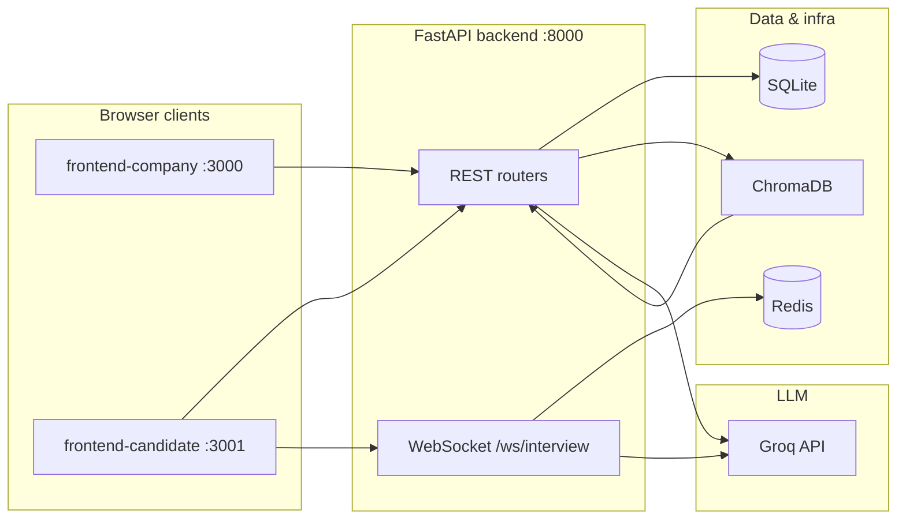

# QuickHire — Codebase Guide

This document explains how the QuickHire monorepo is structured, how data flows between services, and where to change behavior when extending the product. It is written for a developer onboarding to the project or auditing the system for the first time.

---

## 1. What QuickHire Does

QuickHire is a **hiring workflow demo** with three pillars:

1. **Company dashboard** (`frontend-company`) — Register a company and job description, upload candidate CVs, view AI pre-screening results and live interview activity.
2. **Candidate interview app** (`frontend-candidate`) — Pick a company, optionally upload a CV, take an interview (MCQ rounds + coding with Monaco editor), chat with an AI assistant, and see a completion report.
3. **Backend** (`backend`) — FastAPI REST API, WebSocket for the interview sandbox, SQLite for structured data, **ChromaDB** + embeddings for CV RAG, **Redis** for telemetry queueing, and **Groq** (LangChain) for LLM calls.

An optional **`agentic-ai-capstone`** folder may exist as a reference implementation; it is not required to run QuickHire.

---

## 2. Repository Layout

| Path | Role |
|------|------|
| `backend/` | FastAPI app (`main.py`), SQLite, Chroma, WS handler, RAG, LLM wrappers |
| `frontend-company/` | Vite + React; company setup, CV upload, dashboard (port **3000** default) |
| `frontend-candidate/` | Vite + React; interview UI, Monaco editor, assistant (port **3001** default) |
| `docs/` | Documentation (this file) |

**Backend entrypoint:** run from `backend/`:

```bash
cd backend && source venv/bin/activate && uvicorn main:app --reload
```

Default HTTP API: **`http://localhost:8000`**.

---

## 3. High-Level Architecture



- **REST** handles companies, candidates, CV upload + ingestion, interview sessions, answers, completion reports, dashboards.
- **WebSocket** streams telemetry and drives the **interview AI assistant** (hint-style chat).
- **SQLite** is the source of truth for companies, candidates, questions, sessions, reports.
- **Chroma** stores CV chunks for semantic search / ingestion metadata (pre-screening uses extracted text heavily).
- **Redis** receives `telemetry` messages from the client (`LPUSH telemetry:{session_id}`); other telemetry is also persisted via REST to the session row.

---

## 4. Backend (`backend/`)

### 4.1 Application bootstrap — `main.py`

- Creates the FastAPI app with **`lifespan`** that calls **`database.init_db()`** once per process (creates tables, runs lightweight migrations).
- Registers **`CORSMiddleware`** with open origins (`*`) for local development.
- Mounts **`routers.router`** (REST) and **`ws_handler.router`** (WebSocket).

### 4.2 Configuration — `config.py`

All deployment-specific values come from environment variables (typically **`backend/.env`**, loaded via `python-dotenv`).

| Variable | Purpose | Default |
|----------|---------|---------|
| `GROQ_API_KEY` | Groq LLM API key | empty string |
| `REDIS_HOST` / `REDIS_PORT` | Redis for telemetry queue | `localhost` / `6379` |
| `CHROMA_DB_PATH` | Chroma persistence directory | `./chroma_db` (relative to cwd) |
| `SQLITE_DB_PATH` | SQLite file | `./quickhire.db` resolved **under `backend/`** when relative |

**Important:** Relative `SQLITE_DB_PATH` is normalized against the directory containing `config.py`, so starting uvicorn from the repo root vs `backend/` does not accidentally use two different DB files.

### 4.3 Database layer — `database.py`

- **SQLite** via `sqlite3` with `row_factory` for dict-like rows.
- **`init_db()`** defines tables:
  - **`companies`** — id, name, job_title, job_description, requirements (JSON text)
  - **`candidates`** — id, name, email, company_id, cv_chunks, screening_score, screening_result (JSON), status
  - **`interview_questions`** — per-company questions (MCQ + coding), options, correct_answer, order, extra_json
  - **`interview_sessions`** — live session: candidate_id, company_id, rounds, mcq_scores, code_submission, **telemetry_data**, hints_used, cv_path, timestamps
  - **`interview_reports`** — post-interview aggregates for dashboards
  - **`topology_events`** (and related) — reserved for event logging if used
- **`migrate_schema()` / `get_connection()`** — Older DB files get missing columns added at runtime (e.g. `telemetry_data`, `cv_path`) to avoid `OperationalError` on legacy files.
- **Debug logging** — Optional NDJSON logs to `.cursor/debug-*.log` paths for agent/debug sessions; safe to ignore in production.

**When adding a column:** extend `migrate_schema()` / `_ensure_legacy_interview_session_columns` patterns and any serializer that reads the session.

### 4.4 REST API — `routers.py`

Endpoints are grouped logically (exact paths in code):

**Company**

- `POST /api/company` — Multipart form: name, job_title, job_description, requirements. Creates company UUID, saves row, calls **`rag.generate_interview_questions`**, stores questions.
- `GET /api/company/{company_id}` — Single company (+ parsed requirements list)
- `GET /api/companies` — List companies
- `POST /api/companies/clear` — Wipe companies (dev/admin)

**CV pipeline**

- `POST /api/upload-cv` — PDF only. Writes temp file → **`rag.process_and_store_cv`** (Chroma + chunking) → optional **`rag.screen_candidate`** if `company_id` provided → persists candidate + screening JSON.

**Dashboard**

- `GET /api/dashboard/stats` — Aggregates (optional `company_id`)
- `GET /api/dashboard/candidates` — Enriched list; falls back to demo data if empty

**Interview**

- `GET /api/interview/questions/{company_id}` — Load or lazily generate questions
- `POST /api/interview/session/start` — JSON body: candidate_id", company_id, candidate_name; creates session
- `GET/POST .../session/{session_id}` — Session fetch; CV upload for session; telemetry merge; MCQ answer; code submit
- `POST .../complete` — Marks complete, computes MCQ score, pulls telemetry, optional CV text load, heuristic scoring, **`database.save_interview_report`**
- `GET /api/interview/report/{report_id}` and `GET .../session/{session_id}/report` — Read reports
- `GET /api/company/{company_id}/candidate-updates` — Live-style updates for company UI

**Debug**

- `GET /api/debug/db-interview-sessions` — Dev helper: DB path + column names for `interview_sessions`

**Legacy / alternate hint path**

- `POST /api/interview/session/{session_id}/hint` — Query params: code_context, user_query, optional api_key; uses **`rag.generate_code_hints`** with the coding question text as problem description. Useful if you are not using WebSocket chat.

When you add a feature, decide whether it belongs on **REST** (durable, simple clients) or **WebSocket** (streaming / real-time assistant).

### 4.5 WebSocket — `ws_handler.py`

- Route: **`/ws/interview/{session_id}`**
- Message types (JSON):
  - **`telemetry`** — Payload stored in Redis list `telemetry:{session_id}` (see `redis_client.py`).
  - **`init`** — Optional `company_id`: loads company from DB, builds context string, **`agent.set_session_context(session_id, ctx)`** for downstream LLM use, replies `init_ack`.
  - **`chat`** — Candidate assistant: `message`, `editor_code`, optional `api_key`, `provider`. Calls **`rag.generate_code_hints`** with **session company/job context** from **`agent.get_session_context`**.

**Session context wiring:** `set_session_context` / `get_session_context` live in **`agent.py`** in a module-level dict `_session_contexts`. The WebSocket handler must use these functions so hints see the same job description as the rest of the interview.

### 4.6 RAG and LLM — `rag.py`

Responsibilities:

- **Embeddings & Chroma** — `HuggingFaceEmbeddings` (`all-MiniLM-L6-v2`), persistent **`Chroma`** at `CHROMA_DB_PATH`.
- **CV ingestion** — `process_and_store_cv`: PyPDF load, split, embed, store; returns chunk count and full text for screening.
- **`screen_resume` / `screen_candidate`** — Prompts Groq to return structured JSON (match score, verdict, skills, reasoning).
- **`generate_interview_questions`** — Groq generates MCQ + coding-style JSON list for a job description.
- **`generate_code_hints`** — Uses a **strict system prompt** (`INTERVIEW_HINT_SYSTEM`) and **HumanMessage** with problem context + **current editor contents** + user question. Supports default Groq key from env or BYO keys (OpenAI / Groq via LangChain).

Retry logic uses **tenacity** on internal `_llm_call` / `_hint_llm_invoke` helpers.

### 4.7 LangGraph agent — `agent.py`

Defines a small **LangGraph** graph with a single **Socratic hint** node using Groq (`process_chat_message`). This path is suitable for conversational threads; the **primary interview assistant path** in production intent is **`rag.generate_code_hints`** via WebSocket, which injects editor + job context in one shot.

Shared with WebSocket:

- **`set_session_context` / `get_session_context`** — company/job text keyed by interview `session_id`.

### 4.8 Redis — `redis_client.py`

Thin wrapper: `redis.Redis(host=REDIS_HOST, port=REDIS_PORT, decode_responses=True)`.

Telemetry is pushed from WS messages; consumers (if any) would read from `telemetry:{session_id}`. REST also persists merged telemetry on the session for reports.

---

## 5. Data Flow: Typical User Journeys

### 5.1 Company creates a job

1. `frontend-company` → `POST /api/company`
2. Backend saves **`companies`** row
3. **`rag.generate_interview_questions`** → **`interview_questions`** rows linked by `company_id`

### 5.2 Candidate CV pre-screen

1. `POST /api/upload-cv` with PDF + optional `company_id`
2. **`rag.process_and_store_cv`** → Chroma + chunk count
3. If company known: **`rag.screen_candidate`** → JSON stored on **`candidates`**

### 5.3 Candidate interview

1. Load companies → select company → optional CV upload to session
2. `POST /api/interview/session/start` → **`interview_sessions`** row with `session_id`
3. Fetch `GET /api/interview/questions/{company_id}` — drives MCQ + coding rounds in UI
4. MCQ answers → `POST .../answer` updates `mcq_scores` JSON
5. Code → editor state; submit → `POST .../submit-code`
6. Telemetry: browser + `CodeEditor` periodically updates metrics; client may POST `.../telemetry` and/or send WS **`telemetry`**
7. WebSocket **`init`** with `company_id` primes **`agent`** session context
8. WebSocket **`chat`** sends question + **`editor_code`** → hint response (Groq)
9. `POST .../complete` → report persisted, scores computed

---

## 6. Frontends

### 6.1 `frontend-company`

- **Stack:** React 18, Vite 5, Tailwind, Radix UI, Recharts (where used).
- **API base URL:** Hardcoded `http://localhost:8000` in components (`App.tsx`, `CompanySetup.tsx`, `CvUploader.tsx`, etc.). For deployment, centralize in `import.meta.env.VITE_API_URL` pattern.
- **Ports:** `npm run dev` → **3000** (see `package.json` / Vite config).

Main surfaces: company onboarding form, CV upload pipeline UI, dashboard stats and candidate list, interview updates view.

### 6.2 `frontend-candidate`

- **Stack:** React, Vite, **Monaco** (`@monaco-editor/react`), Tailwind, Lucide icons.
- **API base:** `http://localhost:8000` in `App.tsx`.
- **Ports:** **`npm run dev` → 3001**.

Views (state machine in `App.tsx`): company select → CV upload → interview (split: description + editor) → results.

**Components of note:**

- **`CodeEditor.tsx`** — Tracks keystrokes, delete ratio, WPM estimates, exposes `onTelemetryUpdate` / `onCodeChange`.
- **`AiAssistant.tsx`** — Chat UI; sends `type: 'chat'`, `message`, `editor_code`, optional provider API key.
- **`ChallengeDescription.tsx`** — Renders question text / MCQ options.

**Critical implementation note — WebSocket:**

`App.tsx` currently wires a **`MockWebSocket`** class that simulates delayed hint responses **without** contacting the backend. To use the real FastAPI WebSocket (`ws://localhost:8000/ws/interview/{sessionId}`):

- Replace the mock with `new WebSocket(\`ws://localhost:8000/ws/interview/${sessionId}\`)` (or `wss://` in production).
- On `open`, send `init` with `company_id` from the selected company so **`set_session_context`** runs.
- Forward `telemetry` and `chat` messages as already shaped by the components.

Until that swap is made, **`ws_handler.py`** chat logic will not run in the browser for the assistant panel.

---

## 7. Security & Secrets

- **Never commit `backend/.env`** — Contains `GROQ_API_KEY` and possibly other secrets. The root `.gitignore` excludes `**/.env` and variants.
- **CORS** is fully open in `main.py` — tighten for production (specific origins, credentials policy).
- **Candidate BYO API keys** — The assistant UI can send `api_key` to the server; that passes through to LangChain. Treat this as sensitive in transit; prefer server-side Groq only in production or use a token exchange pattern.

---

## 8. Local Development Checklist

1. **Redis** running on `localhost:6379` (optional if you only care about REST + SQLite; WS telemetry still pushes to Redis).
2. **`backend/.env`** with at least `GROQ_API_KEY=...`.
3. **Python venv** in `backend/`, install `requirements.txt`.
4. **`uvicorn main:app --reload`** from `backend/`.
5. **Node** LTS — `npm install` in each frontend; run company on 3000, candidate on 3001.
6. Open company UI → create company → open candidate UI → select company → run interview.

---

## 9. Extension Points

| Goal | Where to change |
|------|-----------------|
| New REST resource | `routers.py` + `database.py` (table + helpers) |
| Stronger hint policy | `INTERVIEW_HINT_SYSTEM` and human template in `rag.generate_code_hints` |
| Real-time assistant transport | Replace `MockWebSocket` in `frontend-candidate/src/App.tsx`; keep message schema in sync with `ws_handler.py` |
| Question generation format | Prompt + JSON parsing in `rag.generate_interview_questions` |
| Scoring / report | `complete_interview` in `routers.py` + `save_interview_report` schema |
| New embedding model | `HuggingFaceEmbeddings` init in `rag.py` (may require re-ingesting CVs) |

---

## 10. File Reference (Quick Index)

| File | Responsibility |
|------|----------------|
| `backend/main.py` | FastAPI app, CORS, router inclusion, lifespan → `init_db` |
| `backend/config.py` | Env vars, path resolution for SQLite |
| `backend/database.py` | SQLite schema, migrations, CRUD helpers |
| `backend/routers.py` | All REST endpoints |
| `backend/ws_handler.py` | Interview WebSocket protocol |
| `backend/redis_client.py` | Redis client factory |
| `backend/rag.py` | Chroma, CV ingestion, screening, questions, hint generator |
| `backend/agent.py` | LangGraph Socratic agent + session context store |
| `frontend-candidate/src/App.tsx` | Candidate flow, telemetry, **WS mock** |
| `frontend-candidate/src/components/CodeEditor.tsx` | Monaco + typing telemetry |
| `frontend-candidate/src/components/AiAssistant.tsx` | Chat payload to WS |
| `frontend-company/src/App.tsx` | Dashboard shell, data fetching |

---

## 11. Troubleshooting

- **Two different SQLite files / missing columns** — Always run uvicorn with cwd `backend/` or rely on `config.py` path normalization; check `GET /api/debug/db-interview-sessions` for the resolved path.
- **Chroma errors on first run** — First embedding download can be slow; ensure disk space under `chroma_db/`.
- **Assistant always generic** — Ensure WebSocket is real, `init` sent with `company_id`, and `editor_code` populated on each chat.
- **Redis connection errors** — WS telemetry `LPUSH` may fail if Redis is down; consider try/except in `ws_handler` if you need graceful degradation.

---

*Last updated to match the QuickHire repo layout and modules described above. When behavior diverges from this guide, treat the code as source of truth and update this document in the same PR.*
